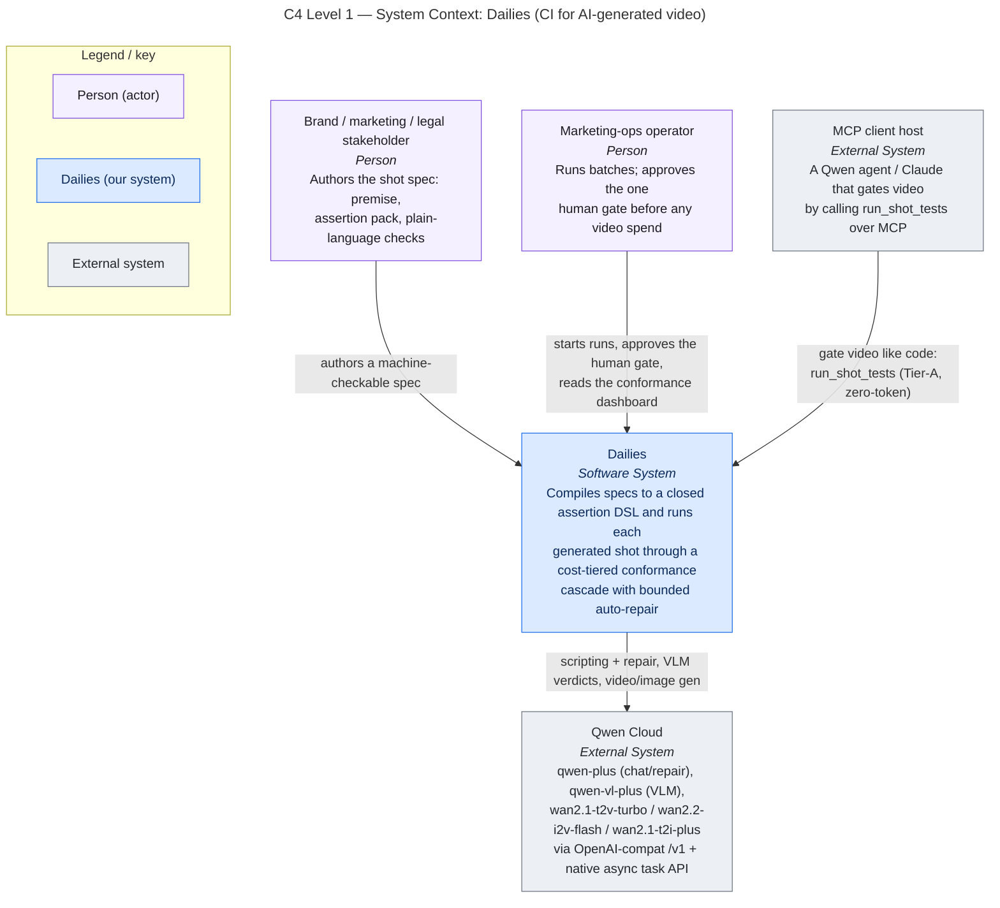
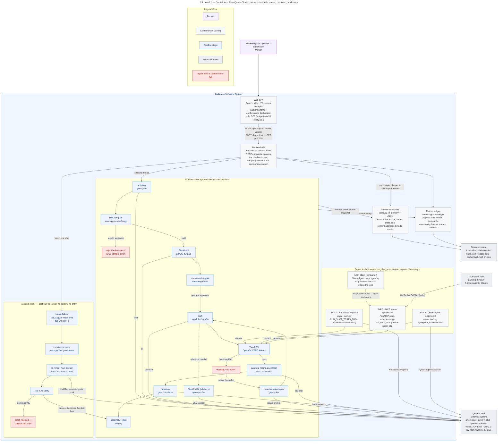
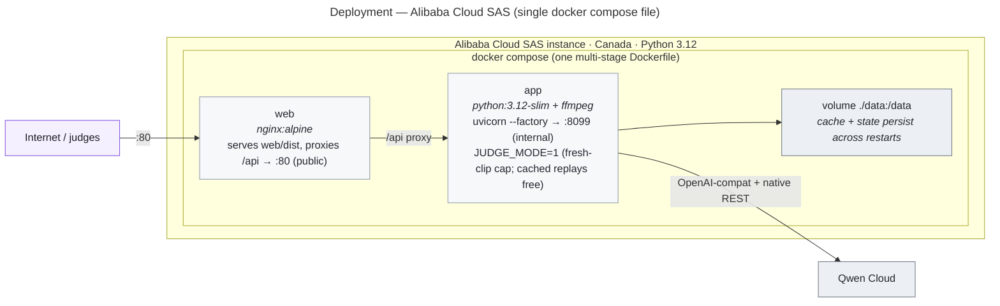

# Dailies architecture

> A rendered version of this is a REQUIRED submission deliverable: "how Qwen Cloud
> connects to your backend, database, and frontend."

Modeled with the [C4 model](https://c4model.com): **Level 1 (System Context)** — who
uses Dailies and which external systems it talks to — and **Level 2 (Container)** — the
deployable/runnable units inside Dailies and how a request flows through them. Levels 3–4
(component/code) are omitted deliberately: they would duplicate the source under
`server/`, which is the ground truth. Every box and edge below is traceable to a file you
can open.

**Diagram conventions.** Each diagram has a title (type + scope) and a legend. Colour is
sparse and purposeful: neutral fills for containers and external systems, a light accent
for actors, and **red reserved for the one path that matters most — reject-before-spend
(a DSL compile error) and the Tier-A hard-fail that triggers auto-repair.**

## Level 1 — System Context

Two human roles that today are collapsed into one overworked reviewer. The **stakeholder**
owns "correct" and authors the spec once (premise + assertion pack + plain-language custom
checks). The **operator** runs batches and is the only human in the loop at runtime — at the
single review gate before any video is paid for. Dailies drives **Qwen Cloud** for every
model call, and exposes its own conformance engine to an **MCP client host** so any agent can
gate video the way it already gates code.

## Level 2 — Container

Reading it as the request flows:

- **Web SPA** (`web/src`) is authoring + dashboard in one. It `POST`s a spec to the API and
  then polls `GET /api/projects/:id` every 2.5s; the poll payload already includes the derived
  `metrics` block, so the dashboard *is* a live view of the conformance report.
- **Backend API** (`server/app.py`) validates the pack, creates the project, and spawns the
  pipeline on a **background thread**. It never blocks on model calls; it just serves reads.
- **Pipeline** (`server/pipeline.py`) is the state machine `scripting → DSL compiler → Tier-0
  still → human gate → drafts → Tier-A CV (+ advisory Tier-B VLM) → bounded auto-repair →
  promote → assembly`. Two paths are red: a sentence outside the closed DSL is a **compile
  error rejected before any spend**, and a **blocking Tier-A FAIL** is the only thing that
  triggers a (budget-bounded) retake. Advisory Tier-B verdicts never block promotion.
  **Promotion is frame-anchored**: the certified final continues from the take the human
  approved (`wan2.2-i2v-flash`) rather than re-rolling from noise, so takes of one shot share
  a look. A shot whose contract asserts camera motion skips promotion and ships the approved
  take, because an anchor frame carries composition but not motion — measured, not assumed
  ([verification §3e](verification.md)).
- **Metrics ledger** (`server/metrics.py`, `server/report.py`) records every Qwen/Wan call and
  derives the frontier / heatmap / repair-convergence numbers the dashboard charts.
- **Store + snapshots** (`server/store.py`) is the "database": in-memory state mutated under an
  RLock, written as an **atomic `state.json` snapshot** after each change, plus a
  **content-addressed media cache** so identical (model, prompt, seed) requests replay for free.
- **Reuse surface** (`server/qwen_tools.py`, `server/mcp_server.py`, `server/mcp_agent.py`)
  exposes the same deterministic `run_shot_tests` engine to a Qwen model **three ways**: a native
  **function-calling tool**, a **Qwen-Agent custom skill** (`@register_tool`), and an **MCP server**
  — the *producer*. Our own **Qwen-Agent MCP client** is the *consumer* that closes the loop (both
  ends ours), while any external MCP host can consume the same server. Runnable, not asserted; the
  full API-to-rubric map is in [qwen-usage.md](qwen-usage.md).

## Deployment topology (Alibaba Cloud SAS)

A push to `main` triggers the deploy workflow (GitHub Actions → SSH → rebuild + health-gate;
setup and failure signatures in [deploy.md](deploy.md)). Proof-of-deployment has two limbs: the
sanctioned Qwen Cloud base URL visible in code (`.env.example`, `server/wan.py`,
`server/app.py`) — done — and the Alibaba Cloud Workbench screenshot of running resources,
captured on the box at deploy time per the runbook's eligibility section. Backend compute runs
on the SAS box, not just API calls from elsewhere.
