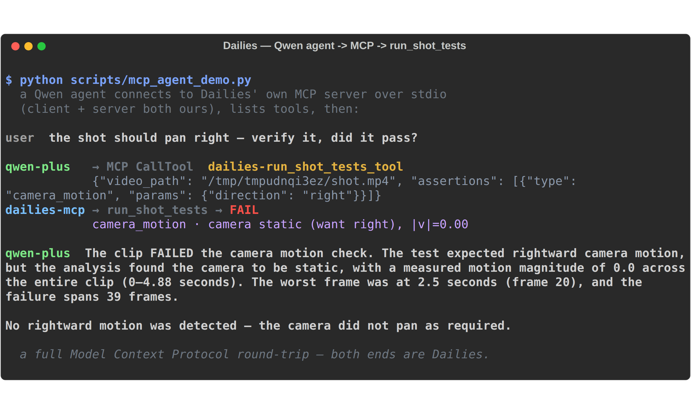

# Demo run-of-show

A beat-by-beat script for the < 3-minute demo video, and what changed since the original cut.
Everything here runs at **zero video quota** (demo mode uses synthetic clips + real CV/ffmpeg;
the Qwen tool/MCP beats spend only a few hundred chat tokens).

## What changed since the original demo

| New capability | Where it shows up | Rubric lever |
|---|---|---|
| **User-authored custom checks** — plain-language rules compiled to the closed vocabulary | Workbench "Custom checks" textarea | Innovation, Impact |
| **`title_card_present`** advisory check (vocab 9 → 10) | Conformance board (draft take) | Innovation |
| **Human-override buttons** on advisory checks | Conformance board | Impact (calibration-corpus moat) |
| **MCP server** exposing `run_shot_tests` | Terminal (`python -m server.mcp_server`) | Technical Depth |
| **Qwen custom tool** (function calling + Qwen-Agent) | `scripts/qwen_tool_demo.py` | Technical Depth |
| **MCP loop** — a Qwen agent consuming our own MCP server | `scripts/mcp_agent_demo.py` | Technical Depth |

The through-line: the same deterministic `run_shot_tests` engine is now reachable **four ways** —
direct Python, an MCP server, a native function-calling tool, and a Qwen-Agent custom tool.

## Setup (once)

```bash
cp .env.example .env                 # add your QWEN_API_KEY
pip install -e ".[dev,mcp,agent]"    # dev tests + MCP server + Qwen-Agent
npm --prefix web install && npm --prefix web run build   # -> web/dist

# Workbench in zero-quota demo mode (or `docker compose up -d --build` for the :80 topology):
DAILIES_DEMO=1 SPA_DIST=web/dist uvicorn server.app:create_production_app --factory --port 8099
```

## Act 1 — The workbench (browser, ~90s)

1. **Author the spec, now with a custom rule.** In "New run", keep the lighthouse premise, then in
   the new **Custom checks** textarea type: `a title card must be visible`. Click **Compile & generate**.
   *Narrate:* a non-video stakeholder just authored a machine-checkable rule in plain language — it
   compiles to the closed vocabulary and is rejected before any spend if it's malformed.
2. **The human gate.** The run stops at *"Review the shot list before spending video budget."* Click
   **Approve & generate**. *Narrate:* the one human checkpoint, before any video tokens.
3. **The kill-shot (unchanged, still the spine).** Shot 1 asserts a rightward camera pan; the first
   draft is static → Tier-A CV catches it → bounded auto-repair retakes → the second draft pans right
   → it passes and ships as-is. *Narrate:* shots 0 and 2 promote to a frame-anchored final that
   continues from the frame you approved; shot 1 does not, because an anchor carries composition but
   not motion — we measured an approved rightward pan promoting into a leftward one. So the clip that
   satisfied the motion contract is the clip that ships, one generation cheaper
   ([verification §3e](verification.md)).
4. **The conformance board — what's new.** Click a shot's **draft take**. Alongside the deterministic
   Tier-A checks, the custom **`title_card_present`** advisory appears with **mark pass / mark fail**
   buttons. *Narrate:* every human override here is a labeled machine-vs-human datum — the calibration
   corpus that makes the gate trustworthy (see [impact.md](impact.md)).
5. **The dashboard + certified episode.** Show the cost-quality frontier, pass-rate heatmap, and
   repair-convergence charts reading the live ledger, then the assembled certified episode.

## Act 2 — Qwen custom tool (terminal, ~30s)

```bash
python scripts/qwen_tool_demo.py
```

*Narrate:* the exact same conformance engine, exposed as a **Qwen custom tool**. `qwen-plus`
autonomously decides to call `run_shot_tests` — first via **native function calling**, then via a
**Qwen-Agent** custom tool — receives the structured report, and explains the `palette_deltae` failure.
This is "custom skills" satisfied concretely, not asserted.

## Act 3 — The MCP loop (terminal, ~30s)

```bash
# (optional) the raw MCP server — the productization surface, gate video like you gate code:
python -m server.mcp_server        # speaks MCP over stdio; Ctrl-C to stop

# the loop: a Qwen agent consuming Dailies' OWN MCP server as a client:
python scripts/mcp_agent_demo.py
```

*Narrate:* a Qwen agent (MCP client) launches Dailies' `run_shot_tests` MCP server, issues
`ListTools` + `CallTool`, and reports the verdict — a complete Model Context Protocol round-trip
where **both ends are ours**. This is the beat the rest of Track 2 can't show: the field
*generates* video; Dailies exposes its **verification gate** as an MCP tool any agent can call,
which is exactly the "MCP integration" the rubric names. How every Qwen surface maps to each
rubric line: [qwen-usage.md](qwen-usage.md).



## Rubric coverage in one run

| Category | Demo beat |
|---|---|
| 💡 Innovation & AI Creativity | Closed-vocabulary compiler + custom checks (Act 1.1); deterministic-before-probabilistic cascade + auto-repair (Act 1.3) |
| ⚙️ Technical Depth & Engineering | MCP server, Qwen custom tool, and the MCP loop (Acts 2–3); the metrics ledger (Act 1.5) |
| 🎯 Problem Value & Impact | Stakeholder-authored spec + human-override calibration data (Act 1.1, 1.4); see [impact.md](impact.md) |
| 📝 Presentation & Documentation | The dashboard charts (Act 1.5); [architecture.md](architecture.md) |

## Notes

- **Zero video quota** throughout: the workbench runs synthetic clips (`DAILIES_DEMO=1`); Acts 2–3
  spend only a few hundred `qwen-plus` chat tokens.
- Acts 2–3 require the `[agent]` extra and a live `QWEN_API_KEY`. The workbench (Act 1) needs neither.
- On the conformance board, advisory VLM checks (`title_card_present`, `identity_consistent`) live on
  the **draft** take — the final take re-runs only the deterministic Tier-A checks, by cost design.
